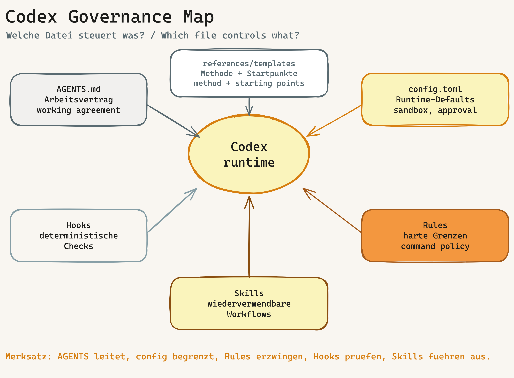
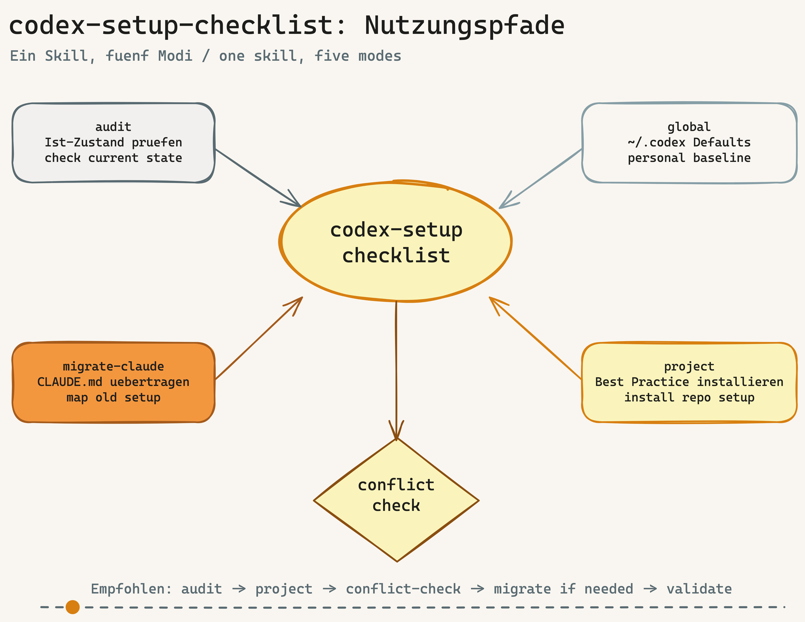

# Handbook: Understanding Codex Governance

## English

This handbook explains the structure behind this repository. It helps users understand what the `codex-setup-checklist` skill does, why the files are separated, and how a good Codex project is organized.

Deutsche Kurzfassung: Dieses Handbuch erklaert das Codex-Governance-Modell, die Rolle jeder Datei und wie der Checklist-Skill dieses Modell installiert oder auditiert. Vollstaendige deutsche Version: [`handbook.de.md`](handbook.de.md).

## 1. The Core Model

Codex works with several instruction layers. A good setup separates these layers deliberately:



| Layer | Purpose | Typical file |
|---|---|---|
| Working agreement | Durable collaboration rules | `AGENTS.md` |
| Runtime defaults | Sandbox, approval, reasoning, web search | `config.toml` |
| Command boundaries | What is allowed, blocked, or approval-gated | `.rules` |
| Deterministic checks | Checks before/after tool use | Hooks |
| Reusable workflows | Audit, setup, migration, conflict checking | `SKILL.md` |
| Method and templates | Explanation, examples, target states | `references/`, `docs/` |

The most important rule: `AGENTS.md` is the router, not the handbook for everything.

## 2. Which File Does What?

### `README.md`

The entry point. It briefly explains what the repository is for, how to install the skill, and where the detailed documentation lives.

### `SKILL.md`

The central skill file. Codex first sees the name and description. When the user activates the skill, Codex reads the full workflow instructions.

### `AGENTS.md`

The durable working agreement for this repository. It describes structure, checks, safety rules, conflict logic, and definition of done.

### `PLANS.md`

A template for longer-running work. It keeps multi-step tasks explicit.

### `code_review.md`

A review checklist for scope, correctness, security, maintainability, and verification.

### `docs/`

User-facing documentation: installation, usage, handbook, and diagrams.

### `references/`

Method references, checklists, and templates. These files explain the logic behind the setup and provide reusable target states.

### `scripts/`

Audit and migration tools. They make parts of the governance model machine-checkable.

## 3. Recommended Project Structure

Minimal:

```text
AGENTS.md
.codex/config.toml
PLANS.md
code_review.md
```

Production:

```text
AGENTS.md
.codex/config.toml
.codex/rules/default.rules
PLANS.md
code_review.md
```

Advanced:

```text
AGENTS.md
.codex/config.toml
.codex/rules/default.rules
.codex/hooks.json
.codex/hooks/pre_tool_use_guard.py
.codex/hooks/stop_summary_check.py
.codex/skills/<skill-name>/SKILL.md
PLANS.md
code_review.md
```

## 4. How the Skill Is Used



| Mode | When to use | Output |
|---|---|---|
| `audit` | Check an existing setup | Findings by severity |
| `global` | Set up personal Codex defaults | Files below `~/.codex/` |
| `project` | Install a best-practice setup in a repo | `AGENTS.md`, `.codex/config.toml`, rules, optional hooks |
| `migrate-claude` | Move Claude structures to Codex | Mapping from Claude files to Codex files |
| `conflict-check` | Detect contradictions | Conflict list and precedence logic |

## 5. How Everything Fits Together

A typical flow for an existing repository:

1. `audit`: understand the current state.
2. `project`: install or update best-practice files.
3. `conflict-check`: check old rules, frameworks, and skills.
4. `migrate-claude`: only if Claude files exist.
5. Validation: run scripts and rerun the audit.

This turns individual files into a coherent operating model.
